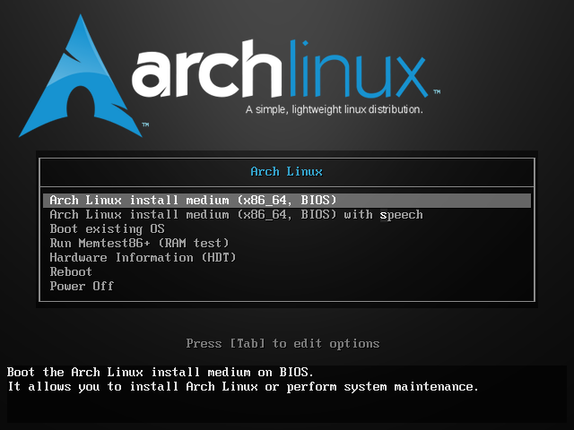

# Arch Linux

## Download

- https://archlinux.org/download/

## Install

### iso tool

make u

### install arch

- lunch

	

- 编辑 `/etc/pacman.d/mirrorlist`，在文件的最顶端添加

	```shell
	Server = https://mirrors.ustc.edu.cn/archlinux/$repo/os/$arch
	```

- update pacman

	```shell
	pacman -Sy
	```

- archinstall

	```shell
	archinstall
	# 可以选择桌面环境
	# pacman install app
	iwd git curl wget net-tools vim 
	```

- reboot

	```shell
	reboot
	```

### network

- wifi

	```shell
	# iwd
	iwctl
	# 获取系统的无线设备名称
	device list
	# 获取 WiFi 网络列表
	station wlan0 get-networks
	# 连接到 WiFi 网络
	station wlan0 connect [SSID]
	# show
	station wlan0 show
	```
- eth

	```shell
	ip link set dev eth0 up
	```

## pacman | yay

### mirror

https://mirrors.ustc.edu.cn/help/archlinux.html

```shell
vim /etc/pacman.d/mirrorlist
# Top add
Server = https://mirrors.ustc.edu.cn/archlinux/$repo/os/$arch
```

### archlinuxcn

https://mirrors.ustc.edu.cn/help/archlinuxcn.html

```shell
# 在 /etc/pacman.conf 文件末尾添加两行：
[archlinuxcn]
Server = https://mirrors.ustc.edu.cn/archlinuxcn/$arch

sudo pacman-key --lsign-key "farseerfc@archlinux.org"
pacman -Sy
```

### yay

```shell
pacman -S yay
```

### app tools

```shell
sudo pacman -S git curl wget vim 7-zip
# oh my zsh # https://ohmyz.sh/#install
sudo pacman -S zsh
sh -c "$(curl -fsSL https://raw.githubusercontent.com/ohmyzsh/ohmyzsh/master/tools/install.sh)"
vim ~/.zshrc
ZSH_THEME="ys"
# docker
sudo pacman -S docker
sudo systemctl enable docker
sudo systemctl start docker
# onedrive
yay -S onedrive
onedrive
onedrive --synchronize --local-first &
```

## locale

```shell
sudo vim /etc/locale.gen
zh_CN.UTF-8 UTF-8
zh_CN.GB2312
zh_CN.GBK GBK
zh_CN.GB18030 GB18030
zh_TW BIG-5 
zh_TW.UTF-8 UTF-8

sudo locale-gen
sudo pacman -S wqy-zenhei
```

## proxy

​	https://gui-for-cores.github.io/guide/01-install.html

- GUI.for.SingBox

  https://github.com/GUI-for-Cores/GUI.for.SingBox/releases/latest

  ```shell
  # 手动创建桌面图标：新建GUI.for.Clash.desktopfile，填入下面内容，然后移动至/usr/share/applications目录。
  [Desktop Entry]
  Version=1.0
  Name=GUI.for.Clash
  Comment=GUI.for.Clash
  Exec=/path/to/GUI.for.Clash/GUI.for.Clash
  Icon=/path/to/GUI.for.Clash/appicon.png
  Terminal=false
  Type=Application
  Categories=Application;GUI.for.Clash;
  StartupNotify=true
  ```

  > 与 windows 一样的使用方法

## cpolar

### sshd

```shell
sudo pacman -S openssh
sudo systemctl enable sshd
sudo systemctl status sshd
vim /etc/ssh/ssh_config
PasswordAuthentication yes
cat .ssh/id_rsa.pub
vim .ssh/authorized_keys
```

### cpolar

```shell
# install
curl -L https://www.cpolar.com/static/downloads/install-release-cpolar.sh | sudo bash
sudo systemctl enable cpolar
sudo systemctl start cpolar
127.0.0.1:9200
# remove
curl -L https://www.cpolar.com/static/downloads/install-release-cpolar.sh | sudo bash -s -- --remove
# Q&A - lookup xxxxx on 1.1.1.1:53: no such host
# vim /etc/resolv.conf 注释 # 1.1.1.1
# Q&A - cpolar use of closed network connection
# 存在的会话数超过了 3 个，处理方法，停止其他 session
```

## GNOME

- UI 缩放问题

	https://wiki.archlinuxcn.org/wiki/HiDPI

	```shell
	# 执行，重启，之后在缩放的比例选项中会出现非整数倍的选项
	gsettings set org.gnome.mutter experimental-features "['scale-monitor-framebuffer']"
	gsettings reset org.gnome.mutter experimental-features
	# 很多应用界面会变模糊，取消
	```

	

---

## opt Hyprland

- ryi

	[https://stormckey.github.io/blog/arch-linux](https://stormckey.github.io/blog/arch-linux--hyprland-%E5%AE%89%E8%A3%85%E5%85%A8%E6%B5%81%E7%A8%8B/#_6)


---

### wifi

```
#!/bin/bash

# wifi
ip link set [wifi card] up
wpa_passphrase Keith Romantic > ./wpa_config
wpa_supplicant -i [] -c ./wpa_config -B
dhcpcd -i [] -B

```

---

## download

​	https://mirrors.aliyun.com/archlinux/iso/?spm=a2c6h.25603864.0.0.11a37b87OeMiB6	

​	https://wiki.archlinux.org/title/Installation_guide_(%E7%AE%80%E4%BD%93%E4%B8%AD%E6%96%87)#%E5%AE%89%E8%A3%85

## grub

    https://wiki.archlinux.org/title/GRUB_(%E7%AE%80%E4%BD%93%E4%B8%AD%E6%96%87)
    ## UEFI 系统
        ## --boot-directory=/mnt/boot
        grub-install --target=x86_64-efi --efi-directory=/boot --bootloader-id=GRUB
    
    ## BIOS 系统
        ## 
        grub-install --target=i386-pc /dev/sdX
    
    ## 配置
        ## 使用 grub-mkconfig 工具来生成 /boot/grub/grub.cfg：
        grub-mkconfig -o /boot/grub/grub.cfg


sudo pacman -S cronie

## app

工具0-
```bash
# 开启支持库和archlinuxcn支持库
vim /etc/pacman.conf
# 开启这个配置，取消下面两行注释
    # [multilib]
    # Include=.....
# 在最后追加下面这个
    [archlinuxcn]
    Server = https://mirrors.ustc.edu.cn/archlinuxcn/$arch
# 检验是否修改成功
pacman -Syyu
sudo pacman -S archlinuxcn-keyring   #cn源中的签名(archlinuxcn-keyring在archLinuxCn)
# 此时可能会报各种错误，进如下网站用root用户执行命令
解决keyring error:https://www.archlinuxcn.org/gnupg-2-1-and-the-pacman-keyring/
su 
pacman -Syu haveged
systemctl start haveged
systemctl enable haveged
rm -fr /etc/pacman.d/gnupg
pacman-key --init
pacman-key --populate archlinux
pacman-key --populate archlinuxcn
exit
sudo pacman -S archlinuxcn-keyring
# 如果没有报错，直接安装yay就好了
sudo pacman -S yay                   #yay命令可以让用户安装AUR中的软件(yay在archLinuxCn)
```
工具1-
```bash
# .deb 包转 Arch Linux 包
# install debtap
git clone https://github.com/helixarch/debtap
cd debtap
sudo cp debtap /usr/local/bin
# 安装相关的软件
sudo debtap -u
# 转换
debtap xxx.deb
# 安装
sudo pacman -U <package-name>
# note    可以用yay安装
yay -S debtap 
```
工具2-
```bash
# 部署 appimage 的工具 AppImageLauncher
# note ：appimage 可直接运行（类似静态编译）
# install
https://github.com/TheAssassin/AppImageLauncher/releases
download appimagelauncher_2.2.0-travis995.0f91801.bionic_amd64.deb
```
输入法
[https://www.jianshu.com/p/cc9dca6543fa](https://www.jianshu.com/p/cc9dca6543fa)
```bash
# 
# sudo pacman -S yaourt
# yaourt fcitx-sogoupinyin
sudo pacman -S rime-double-pinyin
sudo pacman -S fcitx-im fcitx-configtool
sudo touch ~/.xprofile
sudo vim ~/.xprofile
    export LC_ALL=zh_CN.UTF-8   #开机切换中文，不需要可以删除
    export GTK_IM_MODULE=fcitx
    export QT_IM_MODULE=fcitx
    export XMODIFIERS=“@im=fcitx”
# 打开fcitx配置    
```
## 为知笔记

[为知笔记 | 下载 (wiz.cn)](https://www.wiz.cn/zh-cn/download.html)
```bash
# 官网下载 appimage
# 用 AppImageLauncher 打开安装 / 或直接运行
```
## edge

[Download Microsoft Edge Web Browser | Microsoft](https://www.microsoft.com/en-us/edge)

```bash
#下载.deb转
#从软件仓
```
## wps

```bash
#工具
sudo pacman -S yay base-devel
#搜索
yay -Ss wps-office
#install
yay -S ttf-wps-fonts wps-office-mui-zh-cn wps-office-mime-cn wps-office-cn
#install fonts
yay -S wps-office-fonts ttf-ms-fonts
```
## OneDrive

[OneDrive Client for Linux (abraunegg.github.io)](https://abraunegg.github.io/)
```bash
sudo pacman -S make pkg-config curl sqlite ldc
sudo pacman -S libnotify
git clone https://github.com/abraunegg/onedrive.git
cd onedrive
./configure DC=~/ldc2-1.17.0-linux-armhf/bin/ldmd2
make clean; make
sudo make install
```
## PandaVPN

[PandaVPN® | 熊猫VPN Linux 版官方下载 (pandavpnpro.com)](https://pandavpnpro.com/zh-cn/download/linux)
```bash
# 官网下载 appimage
# 用 AppImageLauncher 打开安装 / 或直接运行
```
